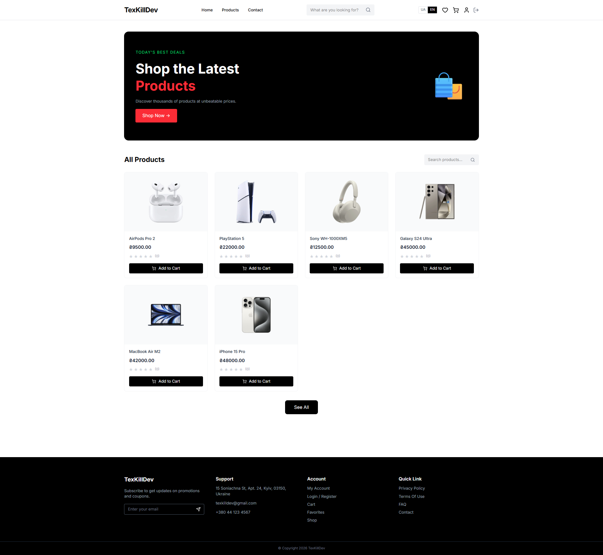
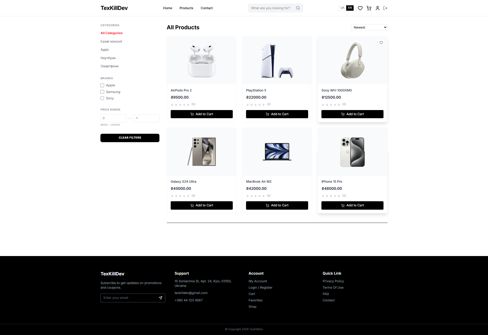
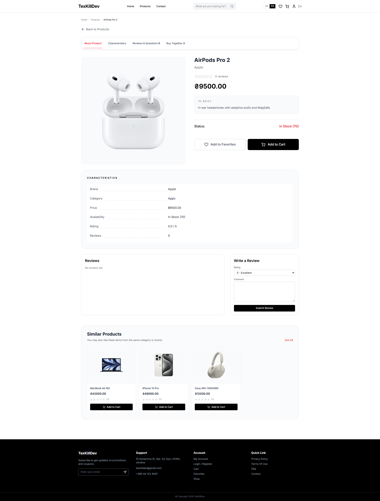
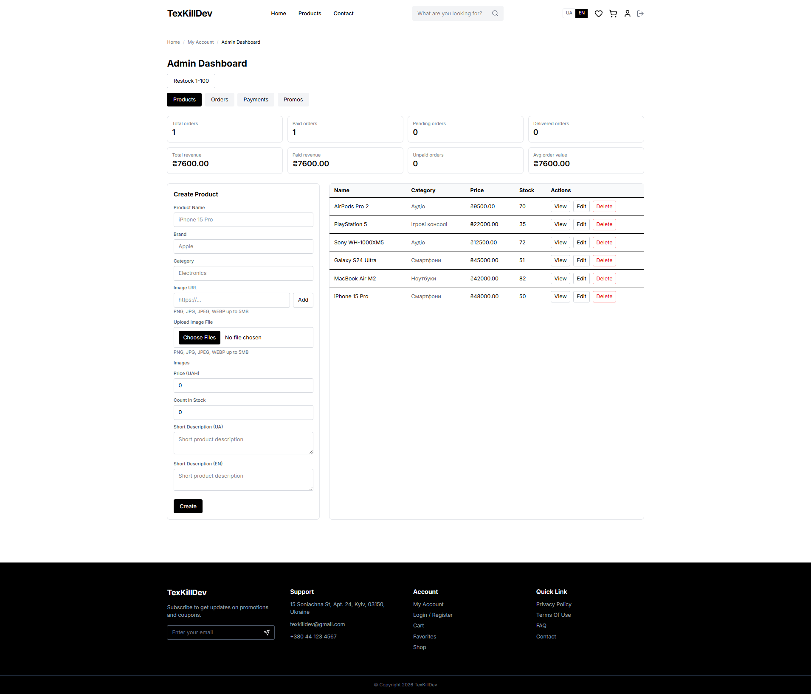

# Ecom Full-Stack

Full-stack e-commerce app with separate `api` and `client` services.

[](https://github.com/TexKill/ecom/actions/workflows/ci.yml)
[](https://github.com/TexKill/ecom/actions/workflows/cd-production.yml)
[](https://github.com/TexKill/ecom/pkgs/container/ecom-api)
[](https://github.com/TexKill/ecom/pkgs/container/ecom-client)

- `api`: Express 5 + TypeScript
- `client`: Next.js 16 App Router + React 19
- `MongoDB`: product catalog
- `PostgreSQL`: users, carts, favorites, orders, promo codes, payments, subscribers
- `Redis`: product cache

## Quick Start

### Local

```bash
git clone https://github.com/TexKill/ecom.git
cd ecom

cd api
npm install
cp .env.example .env
npx prisma generate --config prisma.config.ts

cd ../client
npm install

cd ..
docker compose up -d mongodb postgres redis

cd api
npm run dev

cd ../client
npm run dev
```

Open:

- Client: `http://localhost:3000`
- API: `http://localhost:9000`

### Docker

```bash
git clone https://github.com/TexKill/ecom.git
cd ecom
# fill api/.env first
docker compose up --build -d
```

## Preview

### Home

<a href="docs/images/home.png">
  
</a>

### Catalog

<a href="docs/images/products.png">
  
</a>

### Product Page

<a href="docs/images/product-page.png">
  
</a>

### Admin

<a href="docs/images/admin.png">
  
</a>

## Features

- JWT auth, profile endpoints, token refresh
- User/admin roles
- Product catalog with search, filters, sorting, pagination
- Product reviews
- Cart and favorites
- Checkout and order history
- Admin dashboard for products, orders, payment logs, promo codes
- LiqPay checkout flow
- Cloudinary uploads
- Newsletter subscription
- Redis caching for product lists, filters, and product details

## Frontend Notes

- Next.js App Router
- TanStack React Query for client-side data sync
- Zustand for local stores
- Main storefront pages `/` and `/products` use server-side prefetch for faster first render
- Product images are optimized through Next.js image handling

## Project Structure

```text
ecom/
|-- api/
|   |-- prisma/
|   |-- scripts/
|   |-- src/
|   |   |-- config/
|   |   |-- db/
|   |   |-- middleware/
|   |   |-- models/
|   |   |-- routes/
|   |   |-- services/
|   |   |-- utils/
|   |   `-- validation/
|   |-- Dockerfile
|   `-- prisma.config.ts
|-- client/
|   |-- public/
|   |-- src/
|   |   |-- app/
|   |   |-- components/
|   |   |-- hooks/
|   |   |-- i18n/
|   |   |-- lib/
|   |   `-- store/
|   `-- Dockerfile
|-- deploy/
|-- docs/
|-- .github/workflows/
|-- docker-compose.yml
`-- README.md
```

## Local Development

### 1. Backend

```bash
cd api
npm install
cp .env.example .env
npx prisma generate --config prisma.config.ts
npm run dev
```

Default API URL: `http://localhost:9000`

### 2. Frontend

```bash
cd client
npm install
npm run dev
```

Default client URL: `http://localhost:3000`

## Docker

Requirements:

- Docker Desktop
- filled `api/.env`

Build images:

```bash
docker compose build
```

Start services:

```bash
docker compose up -d
```

Or build and start in one command:

```bash
docker compose up --build -d
```

Services:

- Client: `http://localhost:3000`
- API: `http://localhost:9000`
- MongoDB: `localhost:27017`
- PostgreSQL: `localhost:5432`
- Redis: `localhost:6379`

Useful commands:

```bash
docker compose logs -f
docker compose down
```

Override ports and API URL:

```bash
API_PORT=9001 NEXT_PUBLIC_API_URL=http://localhost:9001 docker compose up --build -d
```

`NEXT_PUBLIC_API_URL` is used by the client at build time and is also exposed at runtime in the container.

## Environment Variables

Template: `api/.env.example`

Required API variables:

- `MONGODB_URL`
- `POSTGRES_URL`
- `JWT_SECRET`
- `CLOUDINARY_CLOUD_NAME`
- `CLOUDINARY_API_KEY`
- `CLOUDINARY_API_SECRET`

Optional LiqPay variables:

- `LIQPAY_PUBLIC_KEY`
- `LIQPAY_PRIVATE_KEY`
- `LIQPAY_SANDBOX`

Optional cache variables:

- `REDIS_URL`
- `REDIS_KEY_PREFIX`
- `CACHE_TTL_SECONDS`

Client variable:

- `NEXT_PUBLIC_API_URL`

If `REDIS_URL` is not set, product cache is effectively disabled.

## Testing

### API

```bash
cd api
npm test
```

The API test runner is cross-platform and discovers `*.test.ts` files under `src/`, so it works in local Windows/macOS/Linux setups and in CI.

### Client

```bash
cd client
npm run lint
npm run build
```

## Database and Prisma

Generate Prisma client:

```bash
cd api
npx prisma generate --config prisma.config.ts
```

Apply production migrations:

```bash
cd api
npx prisma migrate deploy --config prisma.config.ts
```

For local development:

```bash
cd api
npx prisma migrate dev --config prisma.config.ts
```

## Seeding

Seeding is disabled by default.

Enable in `api/.env`:

```env
ENABLE_SEED_ROUTES=true
SEED_KEY=your_secret_key
```

Then call these endpoints with header `x-seed-key: your_secret_key`:

- `POST /api/seed/users`
- `POST /api/seed/products`

## CI/CD

Workflows:

- `.github/workflows/ci.yml`
- `.github/workflows/cd-production.yml`

CI runs on `push` and `pull_request` to `main`:

- API: `npm ci`, `npm run build`, `npm test`
- Client: `npm ci`, `npm run lint`, `npm run build`

CD builds and pushes Docker images to GHCR and can optionally deploy over SSH if deploy secrets are configured.

Expected image names:

- `ghcr.io/<owner>/ecom-api:latest`
- `ghcr.io/<owner>/ecom-client:latest`

## Production Deployment

Deployment files:

- `deploy/docker-compose.prod.yml`
- `deploy/.env.production.example`

Example server bootstrap:

```bash
mkdir -p /opt/ecom
cd /opt/ecom
# copy deploy/docker-compose.prod.yml here
# copy deploy/.env.production.example to .env
```

Typical deploy step:

```bash
docker compose -f docker-compose.prod.yml pull
docker compose -f docker-compose.prod.yml up -d --remove-orphans
```

## Smoke Check

After `docker compose up --build -d`:

1. Open `http://localhost:9000/` and confirm the API health response.
2. Open `http://localhost:3000/` and confirm products load.
3. Check `/products`, `/products/:id`, cart, favorites, and login flow.
4. If seed routes are enabled, seed demo users/products.
5. If LiqPay is configured, test checkout init for an unpaid order.

## NPM Scripts

### `api`

- `npm run dev` - run API with nodemon + ts-node
- `npm run start` - run API with ts-node
- `npm run build` - compile TypeScript
- `npm run prod` - run compiled build
- `npm test` - run API tests
- `npm run restock` - random restock script
- `npm run prisma:generate` - generate Prisma client

### `client`

- `npm run dev`
- `npm run build`
- `npm run start`
- `npm run lint`

## API Quick Reference

### Auth

- `POST /api/users/register`
- `POST /api/users/login`
- `GET /api/users/profile`
- `PUT /api/users/profile`
- `POST /api/users/refresh`

### Products

- `GET /api/products`
- `GET /api/products/filters`
- `GET /api/products/:id`
- `POST /api/products` (admin)
- `PUT /api/products/:id` (admin)
- `DELETE /api/products/:id` (admin)
- `POST /api/products/restock-random` (admin)
- `POST /api/products/:id/reviews`
- `DELETE /api/products/:id/reviews/:reviewId` (admin)

### Orders

- `POST /api/orders`
- `GET /api/orders/myorders`
- `GET /api/orders/:id`
- `PUT /api/orders/:id/status` (admin)
- `DELETE /api/orders/:id` (admin)
- `GET /api/orders` (admin)
- `GET /api/orders/stats` (admin)
- `GET /api/orders/payment-logs` (admin)
- `POST /api/orders/:id/liqpay/checkout`
- `POST /api/orders/liqpay/callback`

### Other

- `GET /api/cart`
- `POST /api/cart`
- `DELETE /api/cart`
- `GET /api/favorites`
- `POST /api/favorites/toggle`
- `DELETE /api/favorites`
- `POST /api/subscribers`
- `POST /api/upload` (admin)
