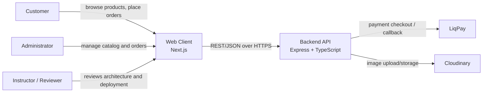
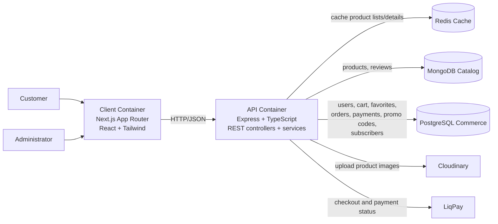
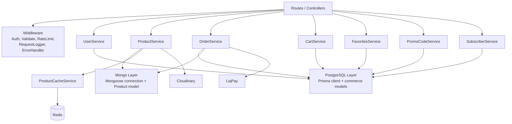
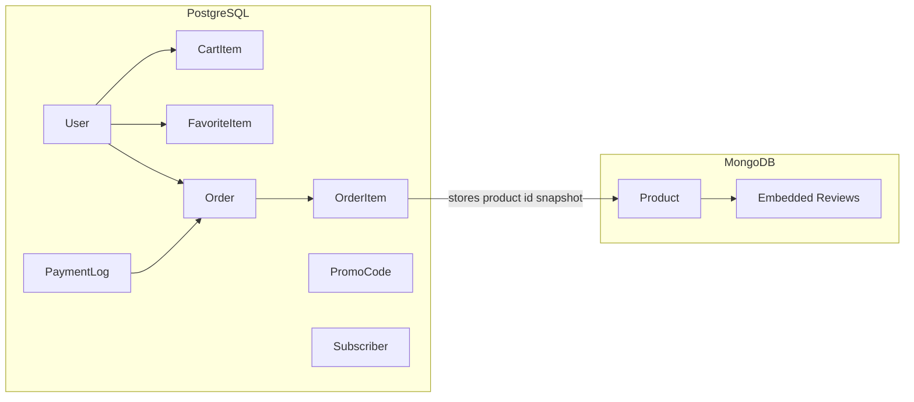
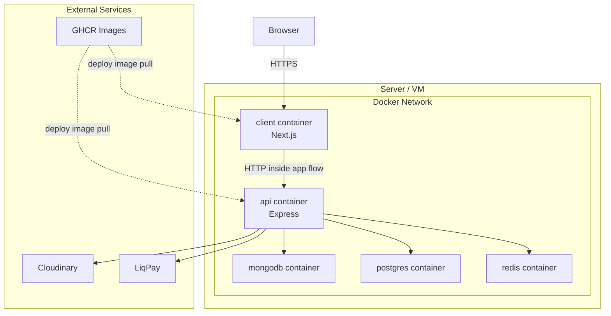

# Architecture and Refactoring Notes

This document summarizes the refactored architecture of the `ecom` project after the transition to polyglot persistence. The diagrams use a C4-style structure in Mermaid so they can be reused in the thesis/report and discussed with the instructor.

## 1. Current State

The application is implemented as a modular monolith:

- `client`: Next.js storefront and admin UI
- `api`: Express REST API with business logic
- `MongoDB`: product catalog database
- `PostgreSQL`: commerce database
- `Redis`: optional cache for product reads
- `Cloudinary`: image storage
- `LiqPay`: payment checkout/callback integration

The persistence layer is now split by domain responsibility:

- `MongoDB` stores `Product` and embedded `reviews`
- `PostgreSQL` stores `User`, `Order`, `OrderItem`, `PaymentLog`, `PromoCode`, `Subscriber`, `CartItem`, `FavoriteItem`

## 2. Refactoring Goal

The refactoring goal was to move from one general-purpose MongoDB database to polyglot persistence:

### Database 1: `MongoDB`

Read-heavy catalog data:

- `Product`
- embedded `reviews`

### Database 2: `PostgreSQL`

Transactional and customer-related data:

- `User`
- `Order`
- `OrderItem`
- `PaymentLog`
- `PromoCode`
- `Subscriber`
- `CartItem`
- `FavoriteItem`

This split is reasonable for the current codebase because:

- product catalog traffic is mostly read-heavy and cacheable
- transactional data has stronger relational structure
- orders and payments benefit from explicit table relations
- the system stays simple enough for a diploma project while demonstrating architectural evolution

## 3. C4 Level 1: System Context

## 4. C4 Level 2: Container Diagram

## 5. C4 Level 3: API Component Diagram

## 6. Data Responsibility View

## 7. Deployment Diagram

## 8. Practical Refactoring Plan

Implemented direction:

1. Keep the application as one API service.
2. Move catalog persistence to a dedicated MongoDB connection.
3. Introduce PostgreSQL with Prisma for commerce data.
4. Move users, cart, favorites, orders, payment logs, promo codes, and subscribers into PostgreSQL.
5. Keep cross-database links explicit by storing product snapshots and product ids in order items.

## 9. What to Tell the Instructor

You can describe the refactoring like this:

> The project remains a modular monolith, but its persistence layer was refactored to polyglot persistence. MongoDB is used for the product catalog because it fits document-oriented catalog data, while PostgreSQL is used for users, orders, payments, carts, and promo codes because those parts benefit from a relational model.

## 10. Notes for the Thesis / Explanatory Report

Good points to mention in the report:

- why C4 was chosen: multiple abstraction levels and better communication
- why the system remains a monolith: lower operational complexity
- why MongoDB stays for catalog data: flexible product documents and review embedding
- why PostgreSQL was introduced: stronger relational model for commerce workflows
- why Redis stays separate: it is a cache, not a source of truth
